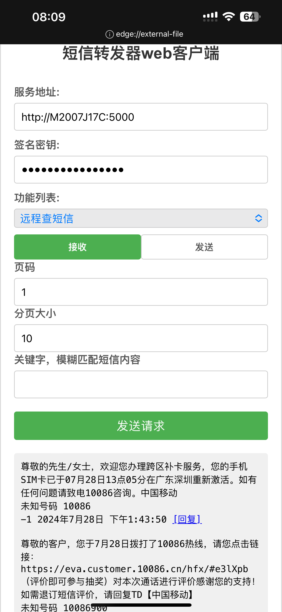

# SmsForwarder-Web-Client
安装[短信转发器服务端](https://github.com/pppscn/SmsForwarder)，然后下载[短信转发器web客户端浏](https://raw.githubusercontent.com/CTCD/SmsForwarder-Web-Client/main/%E7%9F%AD%E4%BF%A1%E8%BD%AC%E5%8F%91%E5%99%A8web%E5%AE%A2%E6%88%B7%E7%AB%AF.html)览器打开即可使用。 http文明传输，不要直接在公网中访问，请配合[zerotier](https://github.com/zerotier/ZeroTierOne)、[tailscale](https://github.com/tailscale/tailscale)或者[wireguard](https://github.com/WireGuard)等内网穿透工具实现公网访问！

